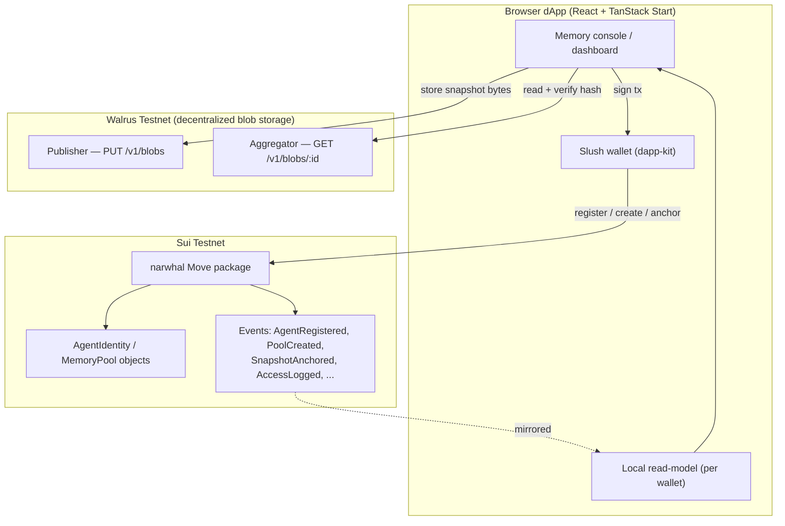

# Narwhal — Verifiable Memory Infrastructure for Autonomous AI Agents

> A permanent, tamper-proof memory layer for AI agents, built on **Sui** and
> **Walrus**. Agents store what they know, what they decided, and why. Other
> agents read it under explicit access rules. Humans audit the full decision
> history at any time.

[](https://suiscan.xyz/testnet)
[](https://docs.wal.app)
[](#-walrus-is-live-and-verified)

---

## 1. Introduction

Autonomous AI agents — trading bots, research assistants, monitoring systems —
make decisions continuously, but their "memory" usually lives in a private
database that:

- **disappears** between sessions,
- **can be silently edited** after the fact, and
- **can't be trusted or audited** by anyone else.

**Narwhal** fixes this. It gives any agent a permanent, content-addressed place
to record its decisions and reasoning, cryptographically anchored so nothing can
be altered without detection. Memory becomes **provable, shareable, and
accountable**.

### Who it's for

| Persona | Need | How Narwhal serves it |
| --- | --- | --- |
| **Developers** building AI agents (trading, research, monitoring, support) | Agents that remember context across sessions | Each agent gets a wallet-owned on-chain identity and an append-only memory timeline stored on Walrus. |
| **Teams** running multiple agents | Agents that coordinate and share findings | **Memory pools** let one agent expose its memory to other agents' addresses under an on-chain allowlist, with every read logged. |

---

## 2. What you can do (and where, in the app)

The dashboard maps 1:1 to the product's core objects:

| Action | Tab | What happens on-chain / on Walrus |
| --- | --- | --- |
| **Register an agent** | Agents | Mints an `AgentIdentity` Sui object owned by your wallet. |
| **Write a memory snapshot** | Memory | Stores `{decision, reasoning, …}` as a Walrus blob, hashes it (SHA-256), and (when a pool exists) anchors `blob_id + hash` on Sui. |
| **Create a shared pool** | Shared pools | Mints a `MemoryPool` object tied to an agent. |
| **Authorize / revoke a reader** | Shared pools | Updates the pool's on-chain reader allowlist (`authorize_reader` / `revoke_reader`). |
| **Audit reads & verifications** | Access log | Lists every authorize / revoke / query / verify event. |
| **Inspect the deployment** | Contract | Package id, module, entry functions, and Suiscan links to every object you own. |

### How the two personas actually use it

- **Developer (single agent, cross-session memory):**
  `Register agent → write snapshots over time → re-open later and the full,
  ordered, verifiable timeline is still there.` Each snapshot can be
  re-fetched from Walrus and its hash re-checked against the stored hash —
  one click in the snapshot dialog ("Verify on Walrus").

- **Team (multiple agents coordinating):**
  `Agent A creates a pool → authorizes Agent B's wallet address → Agent B
  reads A's shared memory.` Every authorization and read is an on-chain event,
  so the collaboration is fully auditable.

---

## 3. Architecture



**Data flow for one memory snapshot:**

1. The agent's decision is serialized to JSON in the browser.
2. The bytes are `PUT` to the Walrus publisher → returns a content-addressed
   **blob id**.
3. The bytes are hashed with **SHA-256** locally.
4. If the agent has a pool, `anchor_snapshot(blob_id, hash, …)` is called on
   Sui, emitting a `SnapshotAnchored` event.
5. Anyone can later `GET` the blob from the Walrus aggregator and re-hash it; if
   it matches the on-chain hash, the memory is provably untampered.

The browser keeps a lightweight **local read-model** (a fast index scoped to the
connected wallet) purely for responsive UI. The **source of truth** is always
Sui events + Walrus blobs — the index can be rebuilt from them.

---

## 4. Walrus — how it's used, and proof it works

Narwhal uses the **public Walrus Testnet HTTP API** (the
publisher/aggregator interface — no API key required):

| Operation | Endpoint | Code |
| --- | --- | --- |
| Store memory | `PUT https://publisher.walrus-testnet.walrus.space/v1/blobs?epochs=N` | `storeBlob()` in `src/lib/walrus.ts` |
| Read memory | `GET https://aggregator.walrus-testnet.walrus.space/v1/blobs/:blobId` | `readBlob()` in `src/lib/walrus.ts` |
| Verify integrity | re-hash the fetched bytes and compare to stored SHA-256 | `sha256Hex()` + snapshot dialog |

### ✅ Walrus is live and verified

A real round-trip against Walrus Testnet:

```bash
# STORE
$ curl -X PUT "https://publisher.walrus-testnet.walrus.space/v1/blobs?epochs=2" \
       --data "AgentLedger walrus test"
{"newlyCreated":{"blobObject":{
   "blobId":"BbxhpNSzKMwAiXVUq2_Qrf68ddZ2OdlIs9Gm_rsoLBg",
   "size":34,"encodingType":"RS2",
   "storage":{"startEpoch":437,"endEpoch":439}, ... }}}

# READ IT BACK
$ curl "https://aggregator.walrus-testnet.walrus.space/v1/blobs/BbxhpNSzKMwAiXVUq2_Qrf68ddZ2OdlIs9Gm_rsoLBg"
AgentLedger walrus test     # <-- exact bytes returned
```

Store → read → hashes match. Walrus storage is **functional and tested**.

---

## 5. Smart contract reference (`narwhal` Move module)

Source: [`move/narwhal/sources/narwhal.move`](move/narwhal/sources/narwhal.move)

### Objects

| Struct | Abilities | Purpose |
| --- | --- | --- |
| `AgentIdentity` | `key, store` | Wallet-owned permanent identity for an agent (`name`, `kind`, `snapshot_count`). |
| `MemoryPool` | `key, store` | Shareable pool tied to an agent, with a `VecSet<address>` reader allowlist. |

### Entry functions

| Function | Effect |
| --- | --- |
| `register_agent(name, kind, clock)` | Creates an `AgentIdentity`, transfers it to caller, emits `AgentRegistered`. |
| `create_memory_pool(agent, name)` | Creates a `MemoryPool`, emits `PoolCreated`. |
| `authorize_reader(pool, reader)` | Adds `reader` to the allowlist (owner only), emits `ReaderAuthorized`. |
| `revoke_reader(pool, reader)` | Removes `reader` (owner only), emits `ReaderRevoked`. |
| `anchor_snapshot(agent, pool, blob_id, content_hash, has_private, clock)` | Binds a Walrus blob id + SHA-256 hash on-chain, emits `SnapshotAnchored`. |
| `log_access(pool, blob_id, clock)` | Records an authorized read, emits `AccessLogged`. |

### Events (the auditable trail)

`AgentRegistered`, `PoolCreated`, `ReaderAuthorized`, `ReaderRevoked`,
`SnapshotAnchored`, `AccessLogged`.

### Access control

- Only a pool's `owner` can authorize/revoke readers (`ENotPoolOwner`).
- `log_access` requires the caller to be the owner or on the allowlist
  (`ENotAuthorized`).
- `anchor_snapshot` requires the caller to own both the agent and the pool.

---

## 6. Deployment

> Full step-by-step guide: [`DEPLOY.md`](DEPLOY.md)

The contract is pre-compiled and bundled at
[`src/lib/narwhal-bytecode.json`](src/lib/narwhal-bytecode.json), so it can be
published **directly from the dashboard** with the connected wallet — no CLI,
no private keys.

1. Connect a **Slush** wallet set to **Testnet** with some test SUI
   (faucet: <https://faucet.sui.io>).
2. Open the dashboard → **Deploy to testnet** → approve in Slush.
3. The app reads the new **package id** from the result; it then appears in the
   **Contract** tab with a Suiscan link.

To recompile from source:

```bash
cd move/narwhal
sui move build --dump-bytecode-as-base64
```

---

## 7. Tech stack

- **Frontend:** React 19 + TanStack Start (SSR), Tailwind CSS v4, Motion.
- **Wallet:** `@mysten/dapp-kit` (Slush / Sui Wallet).
- **Chain:** Sui Move (`2024.beta` edition), Sui Testnet.
- **Storage:** Walrus Testnet (decentralized blob storage), content-addressed.
- **Integrity:** SHA-256 content hashing, verified client-side against Walrus.

---

## 8. Project structure

```
move/narwhal/sources/narwhal.move   # Move smart contract
src/lib/walrus.ts                    # Walrus store/read/verify
src/lib/useNarwhal.ts                # On-chain calls via the wallet
src/lib/chain.ts                     # Package id + Suiscan link helpers
src/lib/sui-config.ts                # Network + Walrus endpoints
src/routes/index.tsx                 # Landing page
src/routes/dashboard.tsx             # Memory console (Agents / Memory / Pools / Access / Contract)
docs/                                # Product & architecture docs
```

See [`docs/`](docs) for the product overview and architecture deep-dive.
