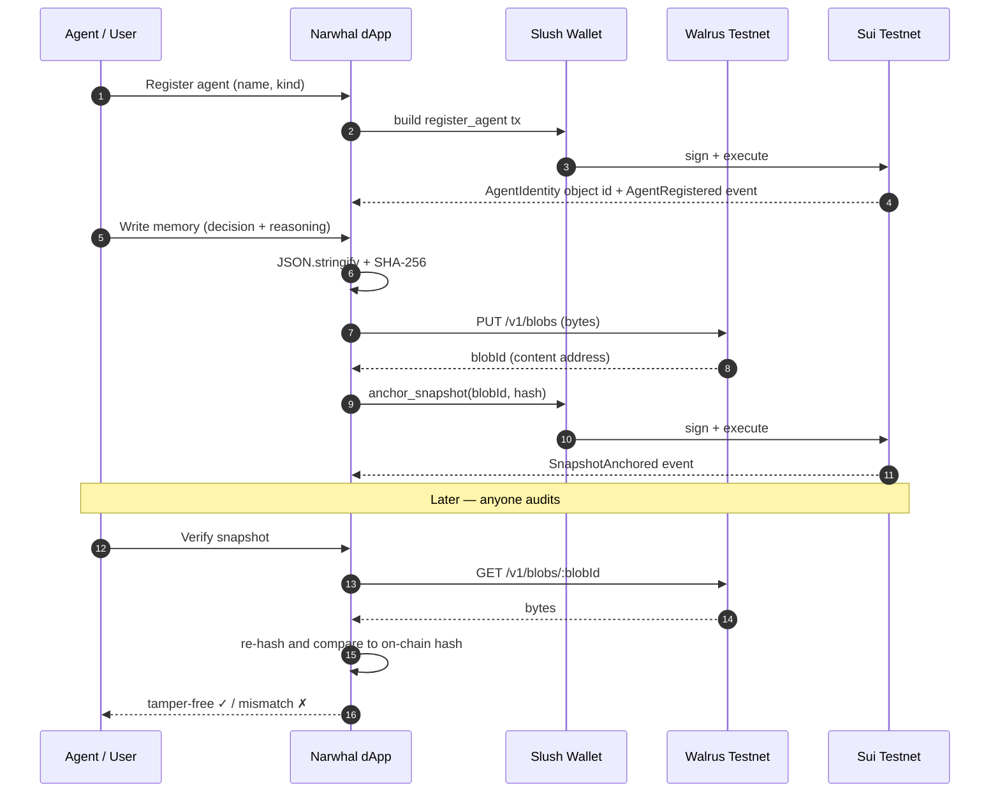

# Architecture

Narwhal has three layers. The **source of truth** is the bottom two (Sui +
Walrus); the browser keeps a fast local read-model for UI only.

## Components

### 1. Sui Move package (`narwhal`)
Owns identity and access control. Agents and pools are first-class Sui objects;
every meaningful action emits an event, forming the audit trail.

### 2. Walrus Testnet
Decentralized, content-addressed blob storage. Memory payloads are stored here;
the blob id is deterministic from the content, so the on-chain hash + blob id
together guarantee integrity.

### 3. Browser read-model
A per-wallet index that mirrors what the agent has done for instant UI. It is
disposable: it can always be rebuilt by replaying Sui events and re-fetching
Walrus blobs.

## Why this is trustworthy

- **Permanence:** blobs persist on Walrus for the paid storage epochs and are
  content-addressed.
- **Tamper-evidence:** changing one byte changes the SHA-256, which no longer
  matches the value anchored on Sui.
- **Accountability:** reads and authorizations are on-chain events; nobody can
  quietly grant themselves access.
